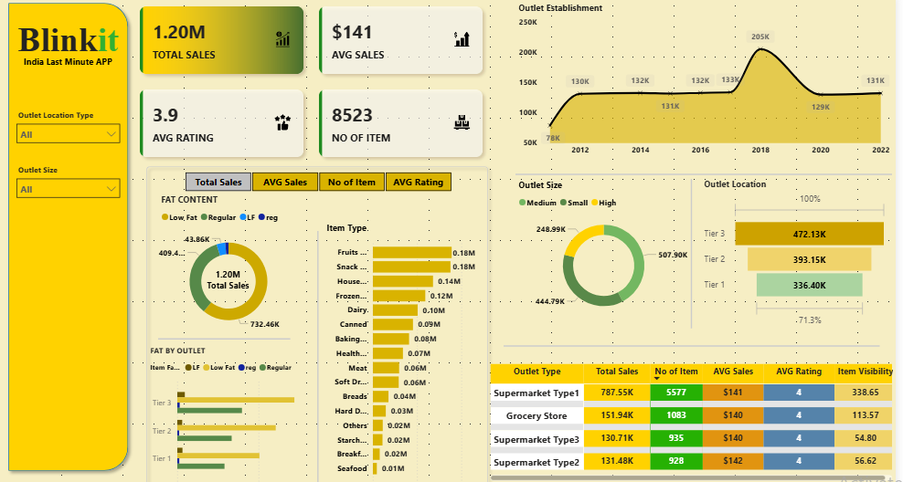

# 🛒 Blinkit Sales & Outlet Performance Dashboard

## 📌 Overview
This project presents an interactive Power BI dashboard analyzing Blinkit outlet performance, sales distribution, item visibility, customer ratings, and store-type insights.  
The dashboard helps understand outlet efficiency, consumer shopping patterns, and product category performance.

---

## 📝 About Blinkit
Blinkit is a leading Indian quick-commerce delivery platform that focuses on delivering groceries and daily essentials within minutes.  
The company operates through various outlet types, sizes, and city tiers, offering fast last-minute delivery across India.  
This dashboard provides a comprehensive analysis of Blinkit’s sales trends, outlet performance, item categories, and customer behavior.

---

## 📷 Dashboard Preview

---

## 📊 Key Features
- **Total Sales, Average Sales, Average Rating, Number of Items**
- **Sales Trend by Outlet Establishment Year**
- **Sales Distribution by Item Type**
- **Fat Content Impact on Sales (Low Fat, Regular)**
- **Outlet Size Analysis (Small, Medium, High)**
- **Outlet Location Type (Tier 1 – Tier 2 – Tier 3)**
- **Item Visibility & Rating Analysis**
- **Outlet Type Comparison Table**
- Fully interactive filters for:
  - Outlet Size  
  - Outlet Location Type  

---

## 🛠️ Tools Used
- Power BI  
- DAX Calculations  
- Data Modeling  
- CSV Data Extraction  
